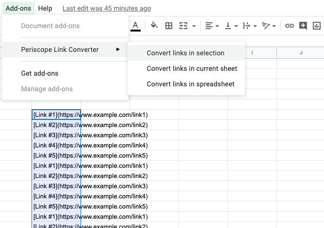
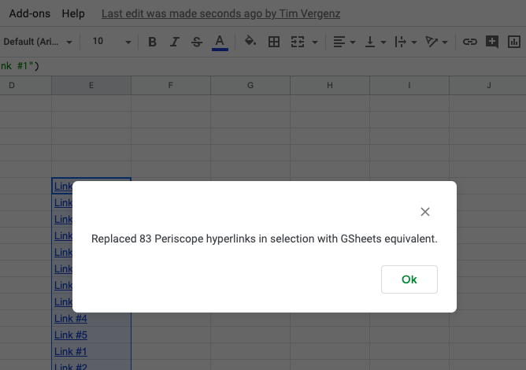
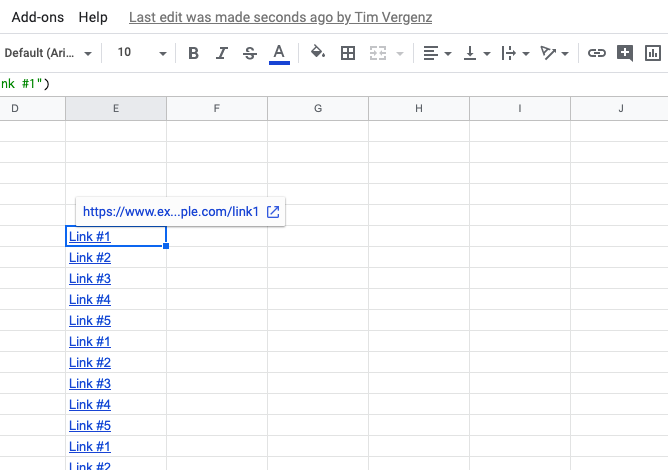

# Periscope Link Converter

A Google Sheets Addon to convert [Periscope-formatted hyperlinks](#periscope-docs) to Google Sheets format.

## Installation
 

## Usage

1. Click Addons > Periscope Link Converter > Convert links in ...

   

2. See confirmation.

   

3. Voilà! Links you can click.

   

## Periscope docs

https://doc.periscopedata.com/article/tables#Hyperlinks:

> ### Hyperlinks
> Tables will automatically convert a valid URL string starting with https:// or https:// into a clickable link. A URL can also be labeled to display a clickable name by utilizing the following syntax:
>
> ```
> select '[Hyperlink Name](https://www.google.com)'
> ```
> 
> This query will result in the table shown below:
> 
> 
> 
> This syntax can also utilize data from individual columns to make the hyperlinked name dynamic. The following query uses "First_Name", "Last_Name", and "Twitter_Account_URL" columns to build out the link:
> 
> Redshift/Postgres:
> 
> ```
> select '[' || First_Name || ' ' || Last_Name || '](' || Twitter_Account_URL || ')' as Customer
> ```
> 
> MySQL/SQLServer/BigQuery/Oracle:
> 
> ```
> select CONCAT('[', First_Name, ' ', Last_Name , '](', Twitter_Account_URL, ')') as Customer
> ```
> 
> The result is shown below, and clicking each link will open up that user's twitter page:
> 
> 
